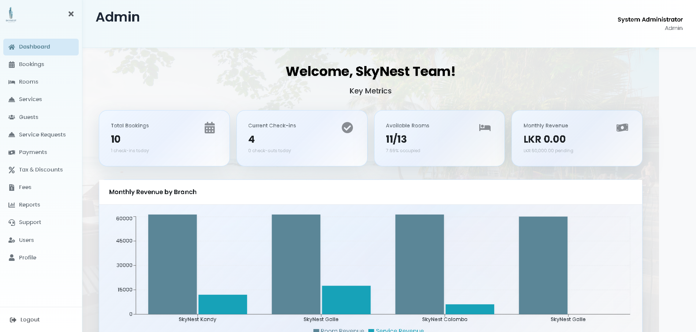
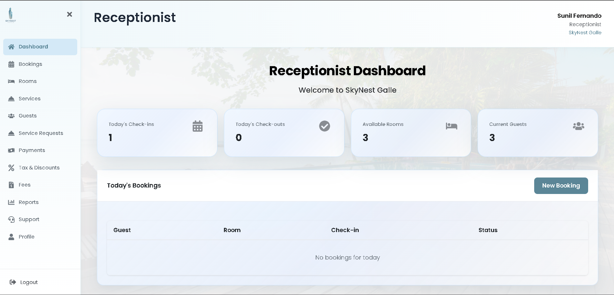

# 🏨 Hotel SkyNest Management System

<div align="center">

**A comprehensive hotel management system with role-based dashboards, real-time billing, and advanced financial management**

[](https://reactjs.org/)
[](https://nodejs.org/)
[](https://www.mysql.com/)
[](LICENSE)

[Features](#-features) • [Installation](#-installation) • [API Docs](#-api-documentation)

</div>

---

## 📸 Dashboard Gallery

<div align="center">

### 🎯 Role-Based Dashboards

<table>
<tr>
<td width="33%" align="center">

<br/><b>Admin Dashboard</b>
<br/><sub>Complete system control & analytics</sub>
</td>
<td width="33%" align="center">

<br/><b>Receptionist Dashboard</b>
<br/><sub>Booking & payment management</sub>
</td>
<td width="33%" align="center">

<br/><b>Guest Dashboard</b>
<br/><sub>Personal bookings & services</sub>
</td>
</tr>
</table>

### 🔑 Authentication & Key Features

<table>
<tr>
<td width="33%" align="center">

<br/><b>Secure Login</b>
<br/><sub>JWT authentication & email verification</sub>
</td>
<td width="33%" align="center">

<br/><b>Booking System</b>
<br/><sub>Real-time availability & pricing</sub>
</td>
<td width="33%" align="center">

<br/><b>Live Billing</b>
<br/><sub>Detailed breakdown with taxes & discounts</sub>
</td>
</tr>
</table>

</div>

---

## ✨ Features

- 🎯 **Role-Based Access Control** - Admin, Receptionist, and Guest dashboards with specific permissions
- 💰 **Advanced Financial System** - Flexible tax, discount, and fee management per branch
- 📊 **Real-Time Billing** - Live bill calculation with automatic updates for services, taxes, and fees
- 🛎️ **Service Management** - Room service, housekeeping, maintenance requests with usage tracking
- 📈 **Comprehensive Reporting** - Revenue, occupancy, service trends, and unpaid booking reports
- 🔐 **Secure Authentication** - JWT-based auth with password hashing and email verification
- 🐳 **Docker Ready** - Multi-container setup with Docker Compose for easy deployment
- ☁️ **Railway Deployable** - Cloud deployment configuration included

## 🚀 Installation

### Docker Setup (Recommended)

```bash
# Clone repository
git clone https://github.com/yourusername/Hotel-SkyNest.git
cd Hotel-SkyNest

# Start with Docker Compose
docker-compose up -d
```

Access:
- **Frontend**: http://localhost
- **Backend API**: http://localhost:5000

### Railway Deployment

1. Connect GitHub repo to [Railway](https://railway.app/)
2. Add MySQL database service
3. Set environment variables: `JWT_SECRET`, `NODE_ENV=production`
4. Railway auto-deploys on push
5. Initialize database using Railway Data tab

### Local Development

```bash
# Database setup
mysql -u root -p
CREATE DATABASE skynest_hotels;
exit
mysql -u root -p skynest_hotels < database/COMPLETE_DATABASE_SETUP.sql

# Backend
cd backend
npm install
npm start  # http://localhost:5000

# Frontend (new terminal)
cd frontend
npm install
npm run dev  # http://localhost:5173
```

**Default Login:**
- Admin: `admin@skynest.com` / `admin123`
- Receptionist: `receptionist@skynest.com` / `receptionist123`
- Guest: `guest@skynest.com` / `guest123`


## 🛠️ Tech Stack

**Frontend:** React 18, Vite, React Router, Axios, CSS3, Lucide Icons  
**Backend:** Node.js, Express.js, MySQL2, JWT, bcrypt  
**Database:** MySQL 8.0+ with stored procedures, triggers, and views  
**DevOps:** Docker, Docker Compose, Nginx, Railway

## 🗄️ Database & Architecture

**Core Tables:** Users, Branches, Rooms, Bookings, Guests, Payments, Services, Taxes, Discounts, Fees, Support Tickets  
**Key Features:** Stored procedures for complex logic, automatic tax/discount calculation, real-time billing, audit logging

**Payment System:**
- Multiple payment methods (cash, card, bank transfer, online)
- Flexible tax configuration (VAT, Service Tax, custom taxes)
- Discount types: percentage, fixed amount, early bird, loyalty, seasonal
- Fee management: late checkout, early checkin, cancellation, damage fees
- Live bill calculation with automatic updates

## 📚 API Documentation

Complete REST API with role-based access control:

**Main Endpoints:**
- `/api/auth` - Authentication (register, login, email verification, password reset)
- `/api/users` - User management (Admin only)
- `/api/branches` - Hotel branch management
- `/api/rooms` - Room management and availability checking
- `/api/bookings` - Booking CRUD, check-in/out, live bill
- `/api/guests` - Guest registration and history
- `/api/payments` - Payment processing, receipts, refunds
- `/api/services` - Service catalogue management
- `/api/service-requests` - Service request handling
- `/api/tax-discount` - Tax and discount configuration
- `/api/fees` - Fee management
- `/api/support` - Support ticket system
- `/api/reports` - Revenue, occupancy, service, and financial reports

**Key Features:**
- JWT authentication on protected routes
- Role-based authorization (Admin, Receptionist, Guest)
- Real-time bill calculation endpoint
- Comprehensive reporting endpoints
- Payment breakdown and receipt generation

## 📝 License

MIT License - see LICENSE file for details.

## 📞 Support

- **GitHub Issues**: [Report bugs or request features](https://github.com/yourusername/Hotel-SkyNest/issues)

---


